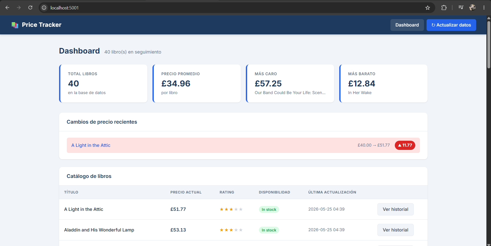
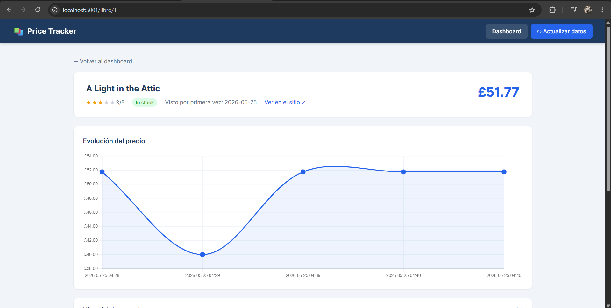

# 📊 Price Tracker

Monitor de precios automatizado con historial, dashboard web y exportación a Excel.

---

## Demo visual

> *Screenshots del dashboard principal y el gráfico de evolución de precios.*

| Dashboard principal | Detalle de producto |
|---|---|
|  |  |

---

## Características principales

- **Scraping resiliente** — manejo de timeouts, errores HTTP, cambios de estructura HTML y rate limiting configurable
- **Historial de precios** — cada ejecución genera un snapshot timestamped; los datos se acumulan sin sobreescribirse
- **Detección de cambios** — compara los dos últimos snapshots de cada producto e identifica subidas y bajadas de precio
- **Dashboard web** — tarjetas de resumen (total, promedio, más caro, más barato), tabla de catálogo y alertas de cambios en verde/rojo
- **Gráfico de evolución** — line chart interactivo por producto con Chart.js
- **Exportación** — Excel con formato de moneda y encabezados estilizados, CSV con encoding UTF-8-BOM para compatibilidad con Excel
- **Automatización** — cron/Task Scheduler para entornos de servidor, o scheduler autocontenido en Python para entornos sin acceso al sistema operativo

---

## Arquitectura

El principio de diseño central es la **separación de responsabilidades**: cada módulo hace una sola cosa y no sabe nada de los otros. Si el sitio fuente cambia su HTML, solo se toca `scraper.py`. Si se quiere cambiar SQLite por PostgreSQL, solo se toca `database.py`.

```
┌─────────────────────────────────────────────────────────┐
│                     FUENTES DE DISPARO                  │
│  python app.py    run_scraper.py    scheduler.py        │
│  (botón web)      (cron / manual)   (proceso Python)    │
└────────────┬────────────────┬───────────────────────────┘
             │                │
             ▼                ▼
┌────────────────────────────────────────┐
│              scraper.py                │
│  extraer_libros() → list[dict]         │
│  Peticiones HTTP · BeautifulSoup       │
│  Rate limiting · Manejo de errores     │
└──────────────────┬─────────────────────┘
                   │  list[dict]
                   ▼
┌────────────────────────────────────────┐
│              database.py               │
│  guardar_snapshot()                    │
│  obtener_libros_con_precio_actual()    │
│  detectar_cambios_precio()             │
│  SQLite · tablas: libros + historial   │
└──────────┬─────────────────────────────┘
           │                   │
           ▼                   ▼
┌──────────────────┐  ┌─────────────────────┐
│     app.py       │  │     export.py        │
│  Dashboard Flask │  │  Excel · CSV         │
│  Chart.js        │  │  openpyxl            │
└──────────────────┘  └─────────────────────┘
```

### Por qué cada módulo está separado

| Módulo | Responsabilidad | Beneficio del aislamiento |
|---|---|---|
| `scraper.py` | Obtener datos del sitio web | Cambiar la fuente de datos no afecta nada más |
| `database.py` | Leer y escribir en SQLite | El motor de base de datos es intercambiable |
| `app.py` | Capa web y rutas HTTP | La interfaz no mezcla lógica de datos |
| `export.py` | Serializar a archivos | Agregar formatos (JSON, Parquet) no toca el resto |
| `run_scraper.py` | Orquestar una corrida | Punto de entrada limpio para cron |
| `scheduler.py` | Temporización autónoma | Alternativa a cron sin dependencias del SO |

---

## Stack técnico

| Categoría | Tecnología |
|---|---|
| Lenguaje | Python 3.10+ |
| Scraping | `requests`, `BeautifulSoup4`, `lxml` |
| Base de datos | SQLite (stdlib `sqlite3`) |
| Web | Flask |
| Gráficos | Chart.js (CDN) |
| Exportación | `openpyxl`, `csv` (stdlib) |
| Scheduling | `schedule` |

---

## Instalación y uso

### Requisitos previos

- Python 3.10 o superior
- Git

### Instalación

```bash
git clone https://github.com/tu-usuario/price-tracker.git
cd price-tracker

python3 -m venv venv
source venv/bin/activate       # Linux / macOS / WSL
# venv\Scripts\activate        # Windows

pip install -r requirements.txt
```

### Correr el dashboard web

```bash
python app.py
```

Abrir [http://localhost:5001](http://localhost:5001) en el navegador.

En la primera visita la base de datos estará vacía. Hacer clic en **Actualizar datos** para ejecutar el primer scrape desde la interfaz.

### Ejecutar el scraper manualmente

```bash
# Con valores por defecto (5 páginas, ~100 productos)
python run_scraper.py

# Personalizar páginas y ruta de la base de datos
python run_scraper.py --paginas 10
python run_scraper.py --paginas 3 --db otra_base.db
```

El log de cada corrida se guarda en `logs/scraper_runs.log`.

### Iniciar el scheduler autocontenido

```bash
# Cada 6 horas (por defecto)
python scheduler.py

# Cada minuto — útil para pruebas
python scheduler.py --intervalo-minutos 1

# Personalizar todo
python scheduler.py --intervalo-minutos 120 --paginas 10

# Detener con Ctrl+C
```

---

## Nota sobre el origen de datos

La implementación actual extrae datos de **[books.toscrape.com](https://books.toscrape.com)**, un sandbox público creado específicamente para practicar web scraping. Fue elegido por tres razones:

1. **Estabilidad garantizada** — el HTML no cambia de forma inesperada, lo que permite enfocarse en la arquitectura del sistema en lugar de en el mantenimiento de selectores.
2. **Sin restricciones de acceso** — no requiere autenticación, no bloquea bots, no tiene rate limits agresivos.
3. **Datos realistas** — catálogo con ~1.000 productos, precios y categorías variadas.

### Por qué no MercadoLibre u otros e-commerce grandes

Los sitios e-commerce de alto tráfico implementan protecciones anti-bot sofisticadas: proof-of-work (challenges JavaScript con SHA-256), fingerprinting de navegador, CAPTCHAs adaptativos y análisis de comportamiento. Estas protecciones hacen que un scraper basado en `requests` sea bloqueado de forma inmediata.

Para esos casos, las opciones viables son:
- **API oficial del marketplace** (cuando existe y cubre los datos necesarios)
- **Automatización de navegador real** con herramientas como Playwright o Selenium, que ejecutan JavaScript y emulan comportamiento humano

La arquitectura de este proyecto anticipa exactamente ese escenario: el módulo `scraper.py` está completamente aislado. Adaptar el tracker a otra fuente de datos —incluyendo una que use Playwright— requiere modificar **solo ese archivo**, sin tocar la base de datos, el dashboard ni la exportación.

---

## Automatización

El proyecto soporta dos enfoques de automatización. Ver [AUTOMATIZACION.md](AUTOMATIZACION.md) para instrucciones detalladas de cada uno.

### Cron (Linux / WSL / macOS)

```bash
crontab -e
```

```cron
# Cada 6 horas
0 */6 * * * cd /ruta/al/proyecto && /ruta/al/venv/bin/python run_scraper.py
```

### Task Scheduler (Windows)

Configurar una tarea que ejecute `venv\Scripts\python.exe run_scraper.py` en el directorio del proyecto con la frecuencia deseada.

### Scheduler de Python (alternativa multiplataforma)

```bash
python scheduler.py --intervalo-minutos 360
```

---

## Estructura del proyecto

```
price-tracker/
├── scraper.py           # Extracción de datos (única fuente de verdad del HTML)
├── database.py          # Persistencia y consultas SQLite
├── app.py               # Dashboard web (Flask)
├── export.py            # Exportación a Excel y CSV
├── run_scraper.py       # Script standalone para cron/Task Scheduler
├── scheduler.py         # Scheduler autocontenido
├── requirements.txt
├── AUTOMATIZACION.md    # Guía detallada de automatización
│
├── templates/
│   ├── base.html        # Layout base con header y navegación
│   ├── index.html       # Dashboard principal
│   └── detalle.html     # Detalle de producto con gráfico
│
├── static/
│   └── style.css        # Estilos del dashboard
│
├── logs/                # Generado en runtime (excluido del repo)
│   └── scraper_runs.log
│
└── exports/             # Generado en runtime (excluido del repo)
    ├── catalogo_*.xlsx
    ├── catalogo_*.csv
    └── historial_*.xlsx
```

Los archivos generados en runtime (`logs/`, `exports/`, `*.db`) están excluidos del repositorio vía `.gitignore`.

---

## Posibles mejoras

| Mejora | Descripción |
|---|---|
| **Notificaciones por email** | Enviar alerta cuando un producto baja de precio usando `smtplib` o SendGrid |
| **Soporte multi-sitio** | Abstraer `scraper.py` en una interfaz común e implementar adaptadores por fuente |
| **API REST** | Exponer los datos vía endpoints JSON para consumo desde otras aplicaciones |
| **Dockerización** | Contenedor con el dashboard y el scheduler, `docker-compose` para levantar el stack completo |
| **Playwright para sitios con JS** | Reemplazar `requests` + BS4 por Playwright en fuentes que requieren renderizado JavaScript |
| **Alertas de disponibilidad** | Detectar cuando un producto pasa de sin stock a disponible |
